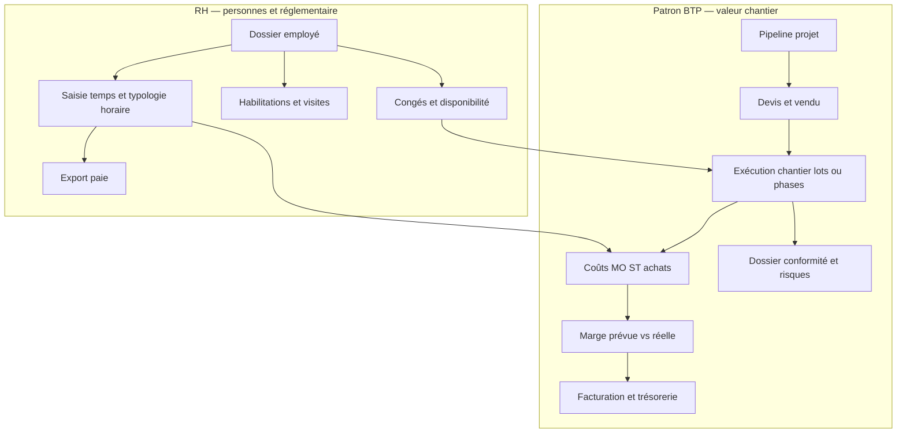

# Vision produit — patron de BTP et responsable RH

Ce document complète la [roadmap technique](ROADMAP.md) en décrivant les attentes métier d’un **dirigeant d’entreprise du BTP** et d’un **responsable des ressources humaines**, ainsi que les écarts possibles par rapport à l’état actuel d’Orkestria. Il sert de guide de priorisation fonctionnelle, pas de spécification d’implémentation.

## Vue d’ensemble (schéma)

Les deux domaines se rejoignent surtout sur **l’affectation réelle des personnes** (temps, disponibilité) et sur **le coût de la main-d’œuvre** dans la marge chantier.

---

## État de référence (rappel)

Orkestria couvre déjà notamment : projets et pipeline commercial, clients, documents avec scopes et contrôle d’accès, employés (rôle, compétences, coût journalier, lien utilisateur), affectation aux projets, saisie du temps, tâches, devis et factures, espaces sous-traitant et client, classification assistée des documents.

---

## Vision patron de BTP

### Pilotage chantier et organisation

- **Lots et sous-ensembles** : structurer un projet en lots ou phases (gros œuvre, second œuvre, corps d’état) pour suivre l’avancement, les responsables et les budgets par volet.
- **Jalons chantier** : réception partielle ou définitive, réserves, levée de réserves, mise en service, période de garantie / SAV — avec dates, statuts et pièces associées.
- **Charge et calendrier** : vue synthétique des chevauchements entre chantiers, pics d’activité et risques de sous-effectif (au-delà des tâches ponctuelles).

### Finances chantier

- **Marge prévue vs réelle** : comparer le vendu (devis) aux coûts engagés : main-d’œuvre interne (temps × coût), sous-traitance, achats — pas seulement le total facturé.
- **Avancement et facturation** : suivre les situations de travaux, acomptes, factures d’avancement, éventuelle **retenue de garantie** et échéances de libération.
- **Trésorerie chantier** : alertes sur écarts entre prévisionnel de trésorerie et réalisé (factures émises / encaissées, décaissements fournisseurs).

### Conformité et risques

- **Dossier conformité par projet** : rattachement documentaire aux attestations (URSSAF, décennale, capacité), **DTA** ou équivalents, assurances, avec dates d’expiration et rappels.
- **Traçabilité** : qui a validé quoi et quand pour les documents à valeur probante (utile en litige ou contrôle).

### Fournisseurs et achats

- **Fournisseurs et bons de commande** : enregistrement des commandes matériel ou prestations, lien au projet ou au lot, montant et statut (commandé, livré, facturé).
- **Rapprochement** : lien entre facture fournisseur et ligne de coût chantier pour affiner la marge réelle.

### Vue consolidée multi-projets

- **Tableau de bord dirigeant** : synthèse des projets actifs, marges, retards, alertes conformité et RH (habilitations à renouveler), charge globale.
- **Indicateurs simples** : taux d’occupation des équipes, panier moyen chantier, délai moyen devis → signature.

---

## Vision responsable RH

### Données employé au-delà du métier

- **Contrat et statut** : type de contrat, dates d’entrée et de fin, période d’essai, temps de travail, classification conventionnelle si pertinent.
- **Multi-entité** : à terme, rattachement à une entité légale ou un établissement si le groupe compte plusieurs structures.

### Temps et paie

- **Export pour la paie** : export structuré des heures (période, employé, projet optionnel) vers un outil de paie ou un tableur contrôlé.
- **Typologie des heures** : distinction jour / nuit, week-end, déplacement, astreinte — même en version minimale — pour coller aux conventions et aux bulletins.

### Compétences et conformité BTP

- **Habilitations et formations** : CACES, SST, travaux en hauteur, électricité, etc., avec dates de validité et **alertes avant échéance**.
- **Visite médicale** : suivi des visites et aptitudes, en lien avec les postes et chantiers autorisés.
- **Matériel et EPI** (optionnel selon cible) : traçabilité des délivrance / recyclage pour les métiers exposés.

### Absences et planning RH

- **Congés, RTT, arrêts** : demandes, validation, calendrier d’équipe pour éviter les trous sur chantier.
- **Intégration charge chantier** : tenir compte des absences prévues dans la planification des affectations.

### Confidentialité et accès (RGPD)

- **Données sensibles** : salaire, santé, sanctions, entretiens — réservées aux profils RH, avec journalisation des accès si besoin.
- **Séparation nette** : ne pas exposer l’intégralité du dossier RH aux scopes « métier » (TECH, etc.) sans politique explicite.

---

## Liens avec l’existant

| Axe métier | Modules ou concepts déjà présents | Piste d’évolution |
|------------|-----------------------------------|-------------------|
| Pipeline commercial et suivi projet | `Project`, statuts, timeline client | Lots, jalons chantier, situations de travaux |
| Chiffre d’affaires et facturation | `Quote`, `Invoice`, PDF | Avancement, retenue de garantie, trésorerie |
| Coût main-d’œuvre | `Employee` (coût journalier), `TimeEntry` | Ventilation types d’heures, export paie, coût réel vs prévisionnel |
| Sous-traitance | Rôles, projets assignés, documents | Commandes ST, montants engagés par lot |
| Documents et preuves | `Document`, scopes, classification | Dossier conformité, échéances, preuves de validation |
| Tâches et exécution | `Task` | Lien lot / jalon, charge consolidée |
| Employés | `Employee`, pages admin | Dossier RH étendu, habilitations, absences |

---

## Pistes de priorisation

**Quick wins (souvent fort impact / effort modéré)**

- Export CSV des temps pour la paie.
- Champs ou entités légères pour **échéances** (habilitations, assurances) avec alertes simples.
- Tableau de bord dirigeant : quelques **KPI** agrégés à partir des données déjà en base (CA devis acceptés, heures saisies, projets par statut).

**Chantiers structurants (fondations produit)**

- Modèle **lots / phases** sur les projets et rattachement financier (devis, coûts, facturation).
- Module **achats / fournisseurs** et lien avec la marge chantier.
- Module **absences** et calendrier RH synchronisé avec les affectations projet.

**À calibrer selon la cible**

- Intégration comptabilité / facturation électronique.
- Gestion avancée des **situations de travaux** et métrés.
- Portail salarié (demande de congés, consultation bulletins) si la roadmap produit le prévoit.

---

*Document aligné sur l’état fonctionnel décrit dans le README et la ROADMAP ; à réviser après chaque évolution majeure du périmètre.*
