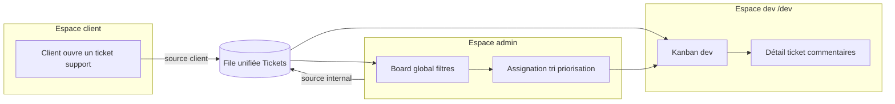
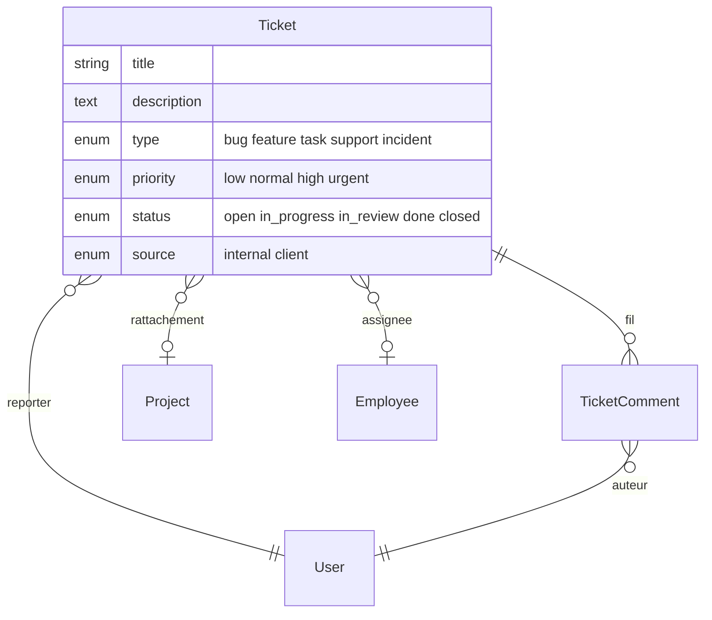
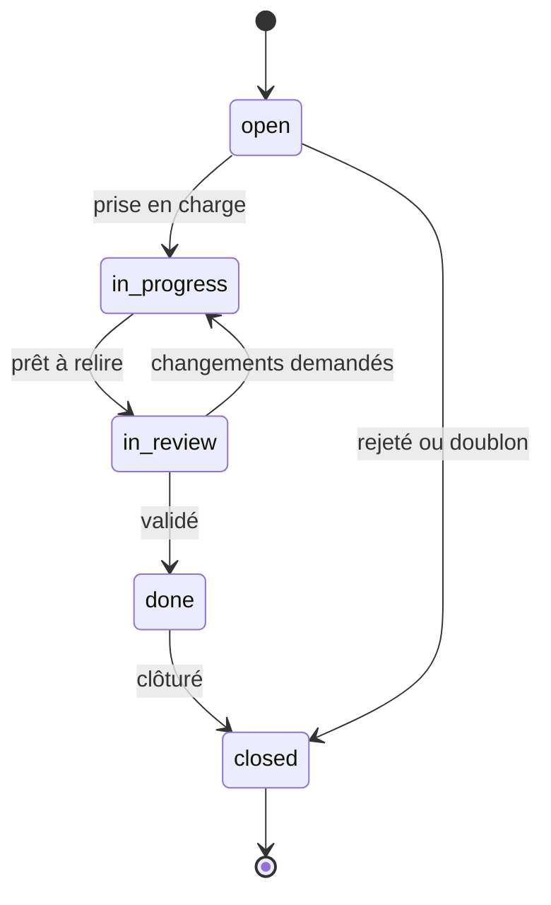

# Vision produit — équipe dev et gestion de tickets

Ce document complète [VISION_BTP_RH.md](VISION_BTP_RH.md) en décrivant la vision produit côté **équipe développement** : comment Orkestria sert les développeurs internes (`ROLE_DEVELOPER`) et comment les clients ouvrent des demandes de support qui aboutissent dans la même file de travail.

---

## Contexte

Le pôle dev d'Orkestria a deux flux d'entrée distincts qui doivent converger :

- **Flux interne** : bugs détectés, refactorings, nouvelles fonctionnalités, dette technique.
- **Flux client / support** : remontées des clients depuis l'espace `/client` (anomalie sur un projet, question fonctionnelle, demande d'évolution).

Une **seule file unifiée** (les tickets) évite la dispersion entre outils externes et garde la traçabilité dans le projet concerné.

---

## Architecture du module

---

## Modèle conceptuel

### Champs clés

| Champ | Rôle |
|-------|------|
| `type` | Catégorise la demande (bug, feature, task, support, incident). |
| `priority` | Tri opérationnel (low → urgent). |
| `status` | Pipeline de traitement (open → in_progress → in_review → done → closed). |
| `source` | Distingue les demandes internes des remontées clients. |
| `reporter` | Qui a ouvert le ticket (utilisé pour les permissions et notifications). |
| `assignee` | Employé en charge (employé typé "dev" via `Employee.role` ou `Employee.skills`). |

---

## Espaces et permissions

| Acteur | Accès |
|--------|-------|
| `ROLE_ADMIN` | Tout (création, édition, suppression, assignation, suppression de commentaires). |
| `ROLE_DEVELOPER` | Lecture / édition / commentaire sur tous les tickets. Espace dédié `/dev`. |
| Reporter (auteur du ticket) | Lecture, commentaire ; modification limitée à la description tant que `status = open`. |
| `ROLE_CLIENT` | Création de tickets `source=client` sur **ses propres projets** uniquement, lecture / commentaire de **ses** tickets. |

La logique est implémentée par un `TicketVoter` dédié (calqué sur `DocumentVoter`).

---

## Pipeline de statut

---

## Vue d'ensemble des fonctionnalités

### Côté admin (`/admin/tickets`)

- Board kanban transverse (toutes les sources, tous les projets).
- Filtres : statut, priorité, type, source, projet, assigné, recherche texte.
- Création de tickets internes.
- Assignation à un employé dev.
- Suppression de tickets.

### Côté dev (`/dev`)

- Dashboard : mes tickets ouverts, par priorité, alertes urgents.
- Kanban personnel (tickets assignés ou non, filtrable).
- Détail ticket avec fil de commentaires.

### Côté client (`/client/projects/[id]`)

- Bouton "Ouvrir un ticket de support" depuis la fiche projet.
- Formulaire simple (titre, description, type bug/support, priorité).
- Liste des tickets ouverts par le client sur ce projet, avec statut.
- Possibilité de commenter pour apporter du contexte.

---

## API

| Méthode | Endpoint | Rôle |
|---------|----------|------|
| GET | `/api/tickets` | Liste filtrée (admin/dev). |
| GET | `/api/tickets/{id}` | Détail. |
| POST | `/api/tickets` | Création interne (admin/dev). |
| PATCH | `/api/tickets/{id}` | Mise à jour (status, assignee, priority, type, description). |
| DELETE | `/api/tickets/{id}` | Suppression (admin). |
| GET | `/api/tickets/{id}/comments` | Fil de commentaires. |
| POST | `/api/tickets/{id}/comments` | Ajouter un commentaire. |
| POST | `/api/client/projects/{projectId}/tickets` | Ouverture d'un ticket par un client. |
| GET | `/api/client/projects/{projectId}/tickets` | Tickets ouverts par le client courant. |

---

## Liens avec l'existant

| Module Orkestria | Lien avec les tickets |
|------------------|-----------------------|
| `Project` | Rattachement optionnel (les tickets clients sont toujours liés à un projet). |
| `Employee` | Assignation. Un dev = `Employee` typé `developer` (via `role` ou `skills`). |
| `User` (`ROLE_DEVELOPER`, `ROLE_CLIENT`) | Permissions et accès aux espaces. |
| `Task` | Reste l'outil d'exécution chantier ; le ticket adresse le suivi dev / support. |

---

## Pistes futures (hors périmètre initial)

- Notifications email à l'assignation et au changement de statut.
- SLA (temps de première réponse, temps de résolution) avec alertes.
- Pièces jointes (s'appuyer sur le module documents existant).
- Labels libres / sprints / itérations.
- Intégration Slack ou équivalent.

---

*Document à maintenir aligné avec le module `Ticket` côté code. Les changements d'API ou de modèle doivent y être reflétés.*
